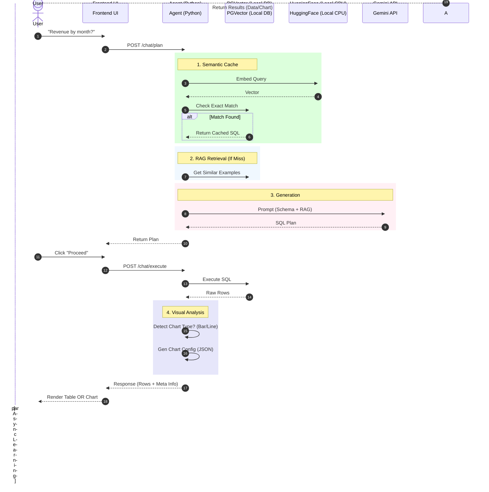

# Backend Flow & Architecture

This document details the internal logic of the **Carwash Analytics Chatbot**. The system uses a **3-Layer Search Architecture** to balance Speed, Accuracy, and Cost.

## Core Logic: The 3 Layers

When a user asks a question, the backend follows this waterfall logic:

| Layer | Component | Goal | Latency | Cost |
| :--- | :--- | :--- | :--- | :--- |
| **1. Cache** | `Golden Queries` (Exact Match) | Instant answer for repeated questions. | ~10ms | $0 |
| **2. RAG** | `PGVector` (Similarity Search) | Find similar past SQL to guide the LLM. | ~50ms | $0 |
| **3. LLM** | `Gemini 2.5 Flash` | Generate new SQL for novel questions. | ~800ms | Low |

---

## Detailed Sequence Diagram

## 5. Chart Auto-Detection (New in Phase 2)
After executing SQL, the backend analyzes the shape of the data to suggest a visualization:
*   **Bar Chart**: If the result contains 1 Categorical Column (Text) and 1 Numeric Column. (e.g. "Revenue by Make")
*   **Line Chart**: If the result contains 1 Time/Date Column and 1 Numeric Column. (e.g. "Sales over time")
*   **Pie Chart**: If the result is small (< 5 rows) and categorical.
*   **Table**: Fallback for everything else.

### 3. `DELETE /chat/history`
1.  **Input**: User JWT Token.
2.  **Action**: Finds the active `ChatSession` for the user.
3.  **Result**: 
    -   Deletes all `ChatMessage` rows for that session.
    -   Deletes the `ChatSession` entry.
    -   Returns `{satus: "success"}`.
4.  **UI Effect**: Resets the chat interface to the welcome state.

## 5. Chart Auto-Detection (Logic & Heuristics)
After executing SQL, the backend analyzes the shape of the data to suggest a visualization:
*   **Bar Chart**: Exactly 2 columns: [Category, Metric]. (e.g., `Make` vs `Count`).
*   **Line Chart**: Exactly 2 columns: [Date/Time, Metric]. (e.g., `Created At` vs `Count`).
*   **Pie Chart**: Small categorical result (< 5 rows).
*   **Table**: Fallback for anything with > 2 columns or mismatched types.

**Note**: To ensure charts render correctly, the LLM System Prompt explicitly enforces a "2-Column Rule" when a visual format is implied.

This config is sent in `meta_info` so the frontend knows exactly what to render.

## 6. Deep Dive: Golden Queries (Auto-Learning)
This table is the **Long-Term Memory** of the chatbot. It doesn't just store text; it stores the *meaning* of the text.

### Schema
| Column | Type | Description |
| :--- | :--- | :--- |
| `id` | `SERIAL` | Unique ID. |
| `question` | `TEXT` | The human verification question. |
| `sql_query` | `TEXT` | The verified SQL answer. |
| `embedding` | `vector(384)` | **The Magic Column**. A list of 384 numbers representing the semantic meaning. |

### How Embeddings Work
The `embedding` column is not random. It is generated using a **Sentence Transformer** model (specifically `all-MiniLM-L6-v2`).

1.  **Input**: "How many customers?"
2.  **Model**: Runs on your local CPU (in `agent.py`).
3.  **Output**: `[-0.012, 0.45, -0.99, ...]` (384 numbers).

**Why do this?**
Computers cannot compare text strings effectively.
- String Match: "Active users" != "Users who are active" (0% match).
- **Vector Match**: "Active users" ~= "Users who are active" (**98% match**).

By converting text to numbers (Vectors), we can use math (Cosine Distance) to find questions that *mean* the same thing, even if they are typed differently.

### Benefits

1.  **Semantic Caching (Speed)**
    - If a user asks "Total revenue?", and we have "What is the total income?" in the DB.
    - The vector distance is tiny (< 0.05).
    - We return the SQL **instantly** (10ms) without needing the slow LLM (800ms).

2.  **RAG Context (Accuracy)**
    - If the user asks a *new* question like "Average revenue per user?", the LLM might struggle with the schema.
    - We find the *nearest* vector (e.g. "Total revenue").
    - We give that valid SQL to the LLM as an example: *"Here is how we calculate revenue..."*
    - The LLM learns from this example and writes perfect SQL.

3.  **Cost Efficiency**
    - Calculating a vector on your CPU is free.
    - Calling an LLM costs credits.
    - By hitting the cache, you save money on every repeated query.

## Data Flow Algorithm

### 1. `POST /chat/plan`
1.  **Input**: User Message string.
2.  **Context Injection (New in Phase 2)**:
    -   Fetch last 3 messages from `chatmessage` table.
    -   Format as "Previous Conversation History" for the LLM.
    -   *Benefit*: Enables follow-up questions like "What about last month?".
3.  **Performance Monitoring (New in Phase 2)**:
    -   Timers track: `Embedding Gen` vs `Vector Search` vs `LLM Generation`.
    -   Logs identifying bottlenecks (e.g., "AI Overload").
4.  **Vectorization**: Convert message to 384-dim vector using `all-MiniLM-L6-v2`.
5.  **Cache Check**: Query `golden_queries` for distance `< 0.05`.
    -   *If Found*: Return immediately.
6.  **Context Retrieval**: Query `golden_queries` for distance `< 0.5` (k=3).
7.  **Prompt Construction**:
    -   System Prompt: "You are a Postgres expert..."
    -   Context: Schema Definitions + Similar Examples + Conversation History.
    -   User Input.
8.  **LLM Call**: Send to Gemini.
9.  **Output**: JSON Plan `{ sql: "...", explanation: "..." }`.

### 2. `POST /chat/execute`
1.  **Input**: SQL string.
2.  **Safety Check**: Ensure SQL is `SELECT` only (enforced by DB Role + Logic).
3.  **Execution**: Run against `Postgres` main DB.
4.  **Analysis**:
    -   If single number -> KPI.
    -   If 2 columns (Label, Value) -> Chart.
    -   Else -> Table.
5.  **Auto-Learning**:
    -   Retrieve the last user message from the session.
    -   Embed it.
    -   Save `(Question, SQL, Embedding)` to `golden_queries` for future Cache/RAG.
