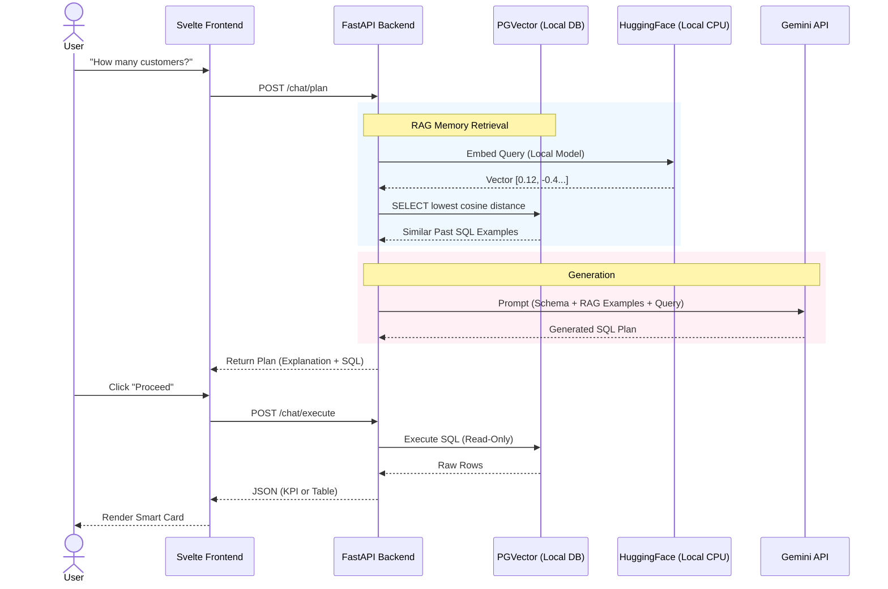

# Carwash Analytics Chatbot 🚗💧

A RAG-enhanced Business Intelligence bot that allows carwash owners to query their data using natural language. Built with **FastAPI**, **Svelte**, **PostgreSQL (pgvector)**, and **Google Gemini**.


## ✨ Features
*   **Natural Language to SQL**: Ask "How many active customers do we have?" and get real data.
*   **Human-in-the-Loop**: The bot proposes a plan (SQL), and you approve it.
*   **Smart Dashboard**: 
    *   **KPI Cards**: Big stats for important numbers.
    *   **Data Tables**: Clean formatting for lists.
    *   **Suggestion Chips**: Quick shortcuts for common business questions.
*   **Secure**: Runs with a Read-Only database user.

## 🛠 Tech Stack
*   **Backend**: FastAPI, LangChain, Google Gemini 2.5 Flash
*   **Frontend**: Svelte 5, TailwindCSS
*   **Database**: PostgreSQL 16 + `pgvector`
*   **Infrastructure**: Docker Compose

## 🚀 Getting Started

### 📋 Prerequisites
Before you begin, ensure you have the following installed:
1.  **Docker & Docker Compose**: For running the database.
2.  **Node.js (v18+) & npm**: For the Svelte frontend.
3.  **Python (v3.10+)**: For the FastAPI backend.
4.  **Google Gemini API Key**: (Optional, if using Cloud LLM).

### ⚙️ Installation & Running

#### 1. Database Setup
Start the local PostgreSQL instance with pgvector.
```bash
# Copy the example environment file
cp .env.example .env

# Start the database container
docker-compose up -d
```
*Note: This runs Postgres on port **5433** to avoid conflicts with any local Postgres you might have.*

#### 2. Backend Setup
Set up the Python environment and start the API.
```bash
cd backend

# Create and activate virtual environment
python -m venv venv
source venv/bin/activate  # On Windows: venv\Scripts\activate

# Install dependencies
pip install -r requirements.txt

# Configure Environment
cp .env.example .env
# Edit .env to set your API Keys (GOOGLE_API_KEY) and Providers
```

Run the server:
```bash
uvicorn app.main:app --reload --port 8000
```
*The API will be available at `http://localhost:8000`.*

#### 3. Frontend Setup
Launch the Svelte dashboard.
```bash
cd frontend

# Install dependencies
npm install

# Start development server
npm run dev
```
Open your browser and visit **`http://localhost:5173`**.

---

## 🔧 Configuration (.env)
You can configure the AI providers in `backend/.env`:

| Variable | Options | Description |
| :--- | :--- | :--- |
| `LLM_PROVIDER` | `gemini` | The Brain. Currently supports Google Gemini. |
| `EMBEDDING_PROVIDER` | `local`, `google` | The Memory. Use `local` for free, private embeddings. |


## 🧠 Architecture (RAG Flow)
This system uses a **Provider-Agnostic** design. By default, it uses **Local Embeddings** (Free/Fast) and **Gemini Flash** (Smart/Cheap).



## 🛠 Tech Stack
*   **Backend**: FastAPI, LangChain
*   **LLM Provider**: Google Gemini 2.5 Flash (Pluggable)
*   **Memory/Embeddings**: **Local HuggingFace** (`all-MiniLM-L6-v2`) or Google API.
*   **Database**: PostgreSQL 16 + `pgvector`
*   **Frontend**: Svelte 5, TailwindCSS


## 📝 License
MIT
